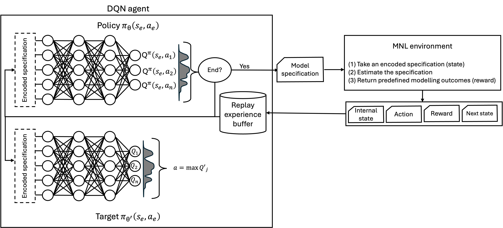

# Delphos

This project presents Delphos, a reinforcement learning framework for assisting discrete choice model specification. By interacting with an estimation environment based on the Apollo package, Delphos represents a paradigm shift: it frames this specification challenge as a sequential decision-making problem, formalised as a Markov Decision Process.

In this setting, an agent learns to specify well-performing model candidates by choosing a sequence of modelling actions — such as selecting variables, accommodating both generic and alternative-specific taste parameters, applying non-linear transformations, and including interactions with covariates — and interacting with a modelling environment that estimates each candidate and returns a reward signal. Specifically, Delphos uses a Deep Q-Network that receives delayed rewards based on modelling outcomes (e.g., log-likelihood) and behavioural expectations (e.g., parameter signs), and distributes rewards across the sequence of actions to learn which modelling decisions lead to well-performing candidates.

Delphos thus contains the main cores to define the MDP to learn which modelling decisions lead to better-performing discrete choice models:

- States: Encoded as list of tuple of model components (e.g., variable, transformation, taste type, interaction).
- Actions: Add, modify, or terminate specification components.
- Environment: Translates the agent’s candidate into a model, runs estimation via Apollo, and computes modelling outcomes.
- Rewards: Delayed signals based on estimation quality (e.g., AIC, LL) and behavioural plausibility (e.g., negative cost coefficient).

For details on the theoretical framework and algorithm design, refer to our paper section “[Delphos](https://arxiv.org/abs/2506.06410)”.

<div align="center">
  
</div>

## Project structure

1. agent.py — This script contains all components related to the RL agent:

- DQNetwork: Neural network model that predicts Q-values for actions.
- ReplayBuffer: Stores past transitions for experience replay.
- StateManager: Encodes and decodes model specifications into internal state representations.
- DQNLearner: Main agent loop, including action selection, training, and early stopping.
- reward_function: Module to compute delayed and normalised rewards using AIC, log-likelihood, ρ², parameter plausibility, and more.

2. environment.py — Encodes the RL environment:

- Converts state tuples into Apollo-compatible utility specifications.
- Interfaces with R to run Apollo model estimation.
- Returns modelling outcomes (e.g., log-likelihood, AIC, parameter estimates).

The environment is model-agnostic and could be extended to support other model families beyond MNL, such as Mixed Logit or Latent Class models.

3. Delphos.py / Delphos.ipynb — This is the main script to run the experiment:

- Initialises agent, environment, and reward function.
- Specifies modelling space parameters: number of variables, transformations, taste types, and covariates.
- Configures reward weightings (e.g., balance between AIC, LL, and adjusted ρ²).
- Executes the training loop, including saving logs and outputs.

4. Swissmetro case /data/ — Dataset and preprocessing

- swissmetro_original.dat: The raw Swissmetro dataset.
- swissmetro.csv: Cleaned and relabelled version of the dataset (e.g., CAR_COST → x_1_1).
- data.ipynb: A Jupyter Notebook to relabel variable names, handle missing values, and prepare the dataset for RL training.
- outputs/: Folder auto-generated during training that stores model outputs from Apollo estimation (e.g., .RData, .out, .log files).

5. Swissmetro case /experiment/ — Agent outputs
   Each subfolder represents training outcomes for a given reward function (e.g., AIC).

- learning_curve.png: Visualisation of the agent’s learning trajectory.
- action_log.csv: All state-action transitions chosen by the agent.
- buffer_log.csv: Experience replay buffer contents over time.
- training_log.csv: Per-episode modelling outcomes and rewards.
- training_metrics.txt: Summary statistics from training.
- agent_log.txt: Logging messages during training episodes.

# Example Use Case: Swissmetro

The agent is trained to specify mode choice models based on the Swissmetro dataset. The environment includes attributes like travel time, cost, and comfort, as well as individual covariates (e.g., income, gender). Over time, Delphos learns to favour plausible and well-performing specifications, avoiding poor or non-convergent models.

1. Clone the repository:

```
git clone https://github.com/gnova3/Delphos.git
cd YOUR_REPO_NAME
```

2. Create and activate a virtual environment:

```
python -m venv env
source env/bin/activate      # On Windows: env\Scripts\activate
```

3. Install Python dependencies:

```
pip install -r requirements.txt
```

4. Install R dependencies
   The environment uses the Apollo package in R. You need:

- R (version ≥ 4.0)
- Required R packages: apollo, data.table, dplyr, readr, etc.
- Ensure Rscript is available from terminal and callable from Python using subprocess.

5. Run code

```
python Delphos.py
```

</br>

For questions, suggestions, or collaborations, contact: [Gabriel Nova](mailto:G.N.Nova@tudelft.nl)
